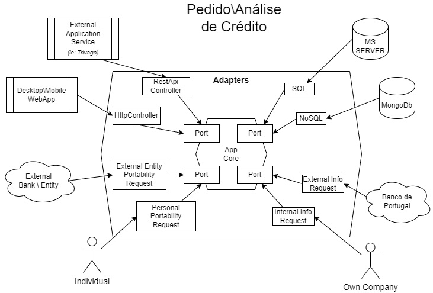

# Hexagonal Architecture Exercise



## Description

This exercise is a simple implementation of a Hexagonal Architecture. The application is a simple credit system that allows for credit listing, portability requests, and credit requests.
The application is divided into two main parts, the Primary and Secondary ports.
The Primary ports are the main entry points for the application, and the Secondary ports are the secondary entry points for the application. The Primary ports are the main entry points for the application, and the Secondary ports are the secondary entry points for the application.

## Requirements

* DotNetCore SDK v8.0

## Sample ouput

```shell
$ dotnet run --project .\Day13HexArchExercise\Day13HexArchExercise.csproj
List current credits of customer: 1
        Credit id:1 with 1000 $

Customer 1 does not have enough credit for 5000 more.
List current credits of customer: 1
        Credit id:1 with 1000 $

================================================================================

List current credits of customer: 2
        Credit id:2 with 2000 $

Customer 2 has enought credit for 5000 more.
Customer: 2
        - Added credit 10 with 2000 $ from portability info? Yes
List current credits of customer: 2
        Credit id:2 with 2000 $
        Credit id:10 with 2000 $
```

## Implementation of Primary Ports

### [ICreditController.cs](./Day13HexArchExercise/Primary/Interfaces/ICreditController.cs)

> Credit listing and be able to check if customer have enough for a given amount.

### [IPortabilityController.cs](./Day13HexArchExercise/Primary/Interfaces/IPortabilityController.cs)

> For portability credit requests from an individual or an external financial entity.

## Implementation of Primary Adapters

### [ExternalPortabilityController.cs](./Day13HexArchExercise/Primary/Adapters/ExternalPortabilityController.cs)

### [HttpController.cs](./Day13HexArchExercise/Primary/Adapters/HttpController.cs)

### [PersonalPortabilityController.cs](./Day13HexArchExercise/Primary/Adapters/PersonalPortabilityController.cs)

### [RestApiController.cs](./Day13HexArchExercise/Primary/Adapters/RestApiController.cs)

---
---

## Implementation of Secondary Ports

### [ICreditRepository.cs](./Day13HexArchExercise/Secondary/Interfaces/ICreditRepository.cs)

> For storing and retrieving credit information from either a SQL or NoSQL databases.

### [IInfoRequester.cs](./Day13HexArchExercise/Secondary/Interfaces/IInfoRequester.cs)

> For requesting information from internal and external entities.

## Implementation of Secondary Adapters

### [ExternalInfoRequester.cs](./Day13HexArchExercise/Secondary/Adapters/ExternalInfoRequester.cs)

### [InternalInfoRequester.cs](./Day13HexArchExercise/Secondary/Adapters/InternalInfoRequester.cs)

### [NoSqlCreditRepository.cs](./Day13HexArchExercise/Secondary/Adapters/NoSqlCreditRepository.cs)

### [SqlCreditRepository.cs](./Day13HexArchExercise/Secondary/Adapters/SqlCreditRepository.cs)
